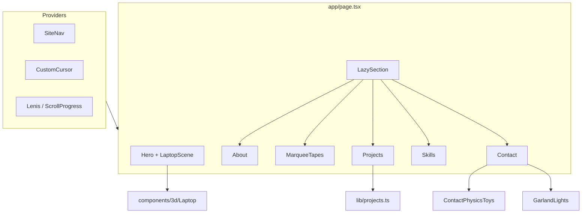

<div align="center">

# Portfolio 2026

**Интерактивное портфолио Backend Go-разработчика**

Один экран — целая история: 3D-рабочее место · проекты в стеклянных папках · орбитальная карта навыков · физика на финальном экране


<sub>Локальный запуск: `npm install && npm run dev` → [http://localhost:3000](http://localhost:3000)</sub>

</div>

---

## О проекте

**Portfolio 2026** — одностраничное портфолио Кати (katshuuu): визуальный сайт-витрина с акцентом на motion, WebGL и аккуратную типографику.

Сайт рассказывает о бэкенд-стеке (Go, PostgreSQL, Redis, Kubernetes и др.) через интерактивные секции, а не через статичный список блоков. Контент проектов (Golandia, FloraMind, MosZapros, PR-pigeon) и ссылки на репозитории задаются в данных; UI собирается на Next.js App Router.

### Что важно в реализации

- **Hero на WebGL** — clay-станция (монитор, клавиатура, кофейный стакан с глазами), звёзды и «стеклянные» шары; сцена ставится на паузу вне viewport.
- **Плавный скролл** — Lenis; dissolve Hero → About без жёстких скачков.
- **Проекты** — стеклянные папки с превью, нижняя полка кейсов и модальные карточки.
- **Навыки** — орбитальная карта планет (хард / софт) с панелью описания.
- **Контакты** — гирлянда со свечением и Matter.js-игрушки (Telegram, GitHub, email и др.), которые можно «кидать» курсором.
- **Производительность** — ленивая подгрузка секций ниже первого экрана, отложенный старт WebGL, лёгкий кастомный курсор.

---

## Содержание

- [Возможности](#возможности)
- [Секции сайта](#секции-сайта)
- [Технологический стек](#технологический-стек)
- [Архитектура](#архитектура)
- [Требования](#требования)
- [Быстрый запуск](#быстрый-запуск)
- [Структура репозитория](#структура-репозитория)
- [Контент и данные](#контент-и-данные)
- [Производительность](#производительность)
- [Сборка](#сборка)
- [Сопровождение](#сопровождение)

---

## Возможности

| Область | Описание |
|---------|----------|
| **Hero** | Интерактивная 3D-композиция, надпись PORTFOLIO (Blue Screen + Snell Roundhand), dissolve при скролле |
| **Обо мне** | Рамка с фото, разделитель, биография; кастомный «металлический» курсор-подсказка |
| **Ленты** | Три бегущие ленты с фразами между About и Projects |
| **Проекты** | 4 стеклянные папки + горизонтальная полка кейсов, модалки с проблемой / решением / результатом |
| **Стек** | Орбиты навыков, переключатель хард/софт, ядро-аватар в центре |
| **Контакты** | Memoji, open to work, liquid-кнопка «написать мне», гирлянда, физика иконок |
| **Навигация** | Фиксированный pill-nav (Bristol) + кнопка `@` с анимацией пузырей |
| **Курсор** | Кастомный указатель со шлейфом (отключается на touch) |

Якорные секции:

| Якорь | Экран |
|-------|--------|
| `#hero` | Главный экран |
| `#about` | Обо мне |
| `#projects` | Проекты |
| `#skills` | Стек |
| `#contact` | Контакты |

---

## Секции сайта

### Hero

3D-рабочее место следует за курсором (экран), глаза у стаканчика тоже. Типографика PORTFOLIO собрана шрифтами проекта, а не картинкой. При уходе с экрана WebGL останавливается (`frameloop: never`).

### Проекты

Папки открывают кейс; превью внутри папки может вести на презентацию (Яндекс.Диск). На полке снизу — краткие карточки с цветом заголовка, согласованным с подписью на папке.

### Стек

Планеты на орбитах: клик подсвечивает навык и показывает описание. Есть хард- и софт-скиллы (в т.ч. концентрация, репетиторство).

### Контакты

Финал на чёрном фоне: гирлянда edge-to-edge, Matter.js-сцена с социальными «игрушками», mailto и Telegram.

---

## Технологический стек

| Слой | Технологии |
|------|------------|
| **Framework** | Next.js 14 (App Router), React 18, TypeScript |
| **Стили** | Tailwind CSS 3, кастомные `@font-face` |
| **3D** | three.js, `@react-three/fiber`, `@react-three/drei` |
| **Motion** | Framer Motion, Lenis, CSS-анимации |
| **Физика** | Matter.js (секция Contact, lazy) |
| **Состояние** | Zustand |
| **Иконки** | lucide-react |

Шрифты в `public/fonts/`: Benzin Bold, Bristol, Snell Roundhand, Blue Screen, Pixelta, Unageo, Asthetic Pixel.

---

## Архитектура



- **Hero** монтируется сразу; WebGL поднимается после первого взаимодействия или короткой задержки.
- Секции ниже первого экрана оборачиваются в `LazySection` и подгружаются при приближении к viewport.
- Matter.js и часть динамики Contact подключаются только когда секция видна.

---

## Требования

| Компонент | Версия |
|-----------|--------|
| Node.js | 20+ (рекомендуется) |
| npm | 9+ |

Бэкенд и база данных для запуска сайта **не нужны** — это статический/SSR фронтенд на Next.js.

---

## Быстрый запуск

```bash
git clone https://github.com/katshuuu/portfolio_2026.git
cd portfolio_2026
npm install
npm run dev
```

Откройте [http://localhost:3000](http://localhost:3000).

| Команда | Назначение |
|---------|------------|
| `npm run dev` | Dev-сервер Next.js |
| `npm run build` | Production-сборка |
| `npm run start` | Запуск собранного приложения |
| `npm run lint` | ESLint |

---

## Структура репозитория

```
portfolio_2026/
├── app/                      # App Router: layout, page, sitemap
├── components/
│   ├── 3d/                   # Laptop, LaptopScene и вспомогательные сцены
│   ├── layout/               # Nav, курсор, Providers, LazySection
│   ├── sections/             # Hero, About, Projects, Skills, Contact…
│   └── ui/                   # LiquidWriteButton и прочий UI
├── hooks/                    # Lenis, reduced motion
├── lib/                      # SITE, PROJECTS, zustand store, utils
├── public/
│   ├── fonts/                # Локальные шрифты
│   └── images/               # Hero, папки проектов, контакты, skills…
├── styles/globals.css        # Токены, анимации, wordmark PORTFOLIO
├── package.json
└── README.md
```

---

## Контент и данные

| Файл | Назначение |
|------|------------|
| [`lib/constants.ts`](lib/constants.ts) | Имя, роль, email, Telegram, GitHub, VK |
| [`lib/projects.ts`](lib/projects.ts) | Кейсы: описание, стек, ссылки, презентации |
| `components/sections/Projects.tsx` → `FOLDER_META` | Папки, превью, цвета подписей |
| `components/sections/Skills.tsx` | Планеты навыков (хард / софт) |
| `public/images/**` | Иллюстрации секций |

Чтобы обновить контакты или ссылки на соцсети — правьте `SITE` в `lib/constants.ts`.  
Чтобы добавить или изменить кейс — правьте `PROJECTS` и метаданные папок в `Projects.tsx`.

---

## Производительность

| Приём | Зачем |
|-------|--------|
| `LazySection` + `next/dynamic` | Нижеfold-код не мешает первому paint |
| Отложенный WebGL | Тяжёлая сцена не блокирует открытие вкладки |
| `frameloop: never` вне Hero | GPU отдыхает при скролле вниз |
| Курсор без постоянного RAF | Шлейф рисуется только пока живёт trail |
| Lenis RAF по движению | Нет вечного scroll-loop в простое |
| DPR WebGL = 1 | Меньше нагрузки на retina |

---

## Сборка

```bash
npm run build
npm run start
```

Для деплоя подойдёт любой хостинг с поддержкой Next.js 14 (Vercel, Node-сервер и т.п.).

---

## Сопровождение

| Задача | Действие |
|--------|----------|
| Сменить контакты / соцсети | `lib/constants.ts` |
| Обновить тексты проектов | `lib/projects.ts` |
| Заменить изображения | `public/images/...` (+ cache-bust `?v=` при необходимости) |
| Подкрутить слово PORTFOLIO | `.portfolio-word*` в `styles/globals.css` |
| 3D-сцена | `components/3d/Laptop.tsx`, `LaptopScene.tsx` |

---

<div align="center">

**katshuuu** · [Telegram](https://t.me/katshuuu) · [GitHub](https://github.com/katshuuu)

</div>
